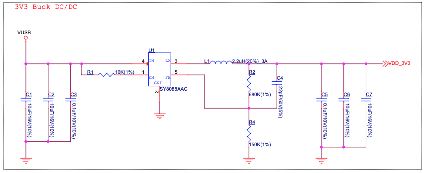
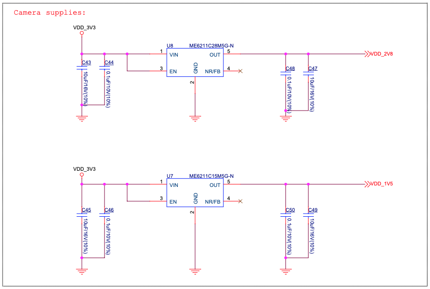
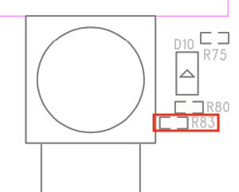
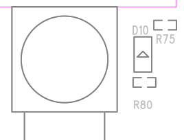
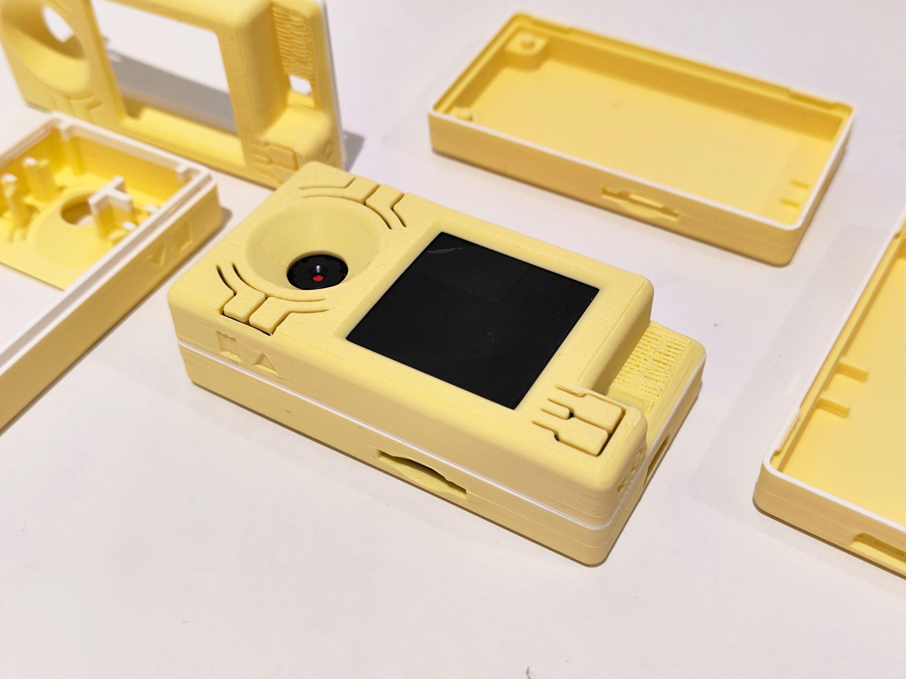

# ESP32-S3-EYE v2.2 <!-- omit in toc -->

[[English Version]](../../en/get-started/ESP32-S3-EYE_Getting_Started_Guide.md)

- [1. 入门指南](#1-入门指南)
  - [1.1. 概述](#11-概述)
  - [1.2. ESP32-S3-EYE 与 ESP-EYE](#12-esp32-s3-eye-与-esp-eye)
  - [1.3. 功能框图](#13-功能框图)
  - [1.4. ESP32-S3-EYE-MB 主板组件](#14-esp32-s3-eye-mb-主板组件)
  - [1.5. ESP32-S3-EYE-SUB 子板组件](#15-esp32-s3-eye-sub-子板组件)
  - [1.6. 内含组件和包装](#16-内含组件和包装)
    - [1.6.1. 零售订单](#161-零售订单)
    - [1.6.2. 批量订单](#162-批量订单)
  - [1.7. 默认固件和功能测试](#17-默认固件和功能测试)
- [2. 开始开发应用](#2-开始开发应用)
  - [2.1. 必备硬件](#21-必备硬件)
  - [2.2. 可选硬件](#22-可选硬件)
  - [2.3. 硬件设置](#23-硬件设置)
  - [2.4. 软件设置](#24-软件设置)
- [3. 硬件参考](#3-硬件参考)
  - [3.1. GPIO 分配](#31-gpio-分配)
  - [3.2. 独立的模组与摄像头供电电路](#32-独立的模组与摄像头供电电路)
- [4. 硬件版本](#4-硬件版本)
  - [4.1. 改版历史](#41-改版历史)
  - [4.2. 已知问题](#42-已知问题)
- [5. 相关文档](#5-相关文档)
  - [5.1. 技术规格书](#51-技术规格书)
  - [5.2. 原理图](#52-原理图)
  - [5.3. PCB 布局图](#53-pcb-布局图)
  - [5.4. 尺寸图](#54-尺寸图)
  - [5.5. 3D打印外壳](#55-3D打印外壳)

本指南将帮助您快速上手 ESP32-S3-EYE v2.2，并提供该款开发板的详细信息。

> **注意**
>
> 如果您使用的是 ESP32-S3-EYE v2.1，请参考本指南。v2.2 相对 v2.1 的变化在[硬件版本](#4-硬件版本)小节中列出。

ESP32-S3-EYE 是[乐鑫](https://www.espressif.com/zh-hans/home)推出的一款小型 AI（人工智能）开发板，搭载 [ESP32-S3](https://www.espressif.com/zh-hans/products/socs/esp32-s3) 芯片和乐鑫 AI 开发框架 [ESP-WHO](https://github.com/espressif/esp-who/blob/master/README_CN.md)。开发板配置一个 2 百万像素的摄像头、一个 LCD 显示屏和一个麦克风，适用于图像识别和音频处理等应用。板上还配有 8 MB 八线 PSRAM 和 8 MB flash，具有充足的存储空间。此外，ESP32-S3 芯片还为开发板提供了 Wi-Fi 图传和 USB 端口调试等功能。您可以使用 ESP-WHO 开发各种 AIoT（人工智能物联网）应用，例如智能门铃、监控系统、人脸识别打卡机等。

|  | 
|:--:| 
|ESP32-S3-EYE|

本指南包括如下内容：

-  [入门指南](#1-入门指南)：介绍了开发板的功能和特性、组件、包装，以及如何快速使用开发板。
-  [开始开发应用](#2-开始开发应用)：说明了开发板烧录固件需要的硬件设置和软件设置。
-  [硬件参考](#3-硬件参考)：详细介绍了开发板的硬件。
-  [硬件版本](#4-硬件版本)：介绍硬件历史版本和已知问题，并提供链接至历史版本开发板的入门指南（如有）。
-  [相关文档](#5-相关文档)：列出了相关文档的链接。

# 1. 入门指南

## 1.1. 概述

ESP32-S3-EYE 开发板包含两部分：一块主板 ESP32-S3-EYE-MB，配置 ESP32-S3-WROOM-1 模组、摄像头、SD 卡槽、数字麦克风、USB 接口和功能按键等；一块子板 ESP32-S3-EYE-SUB，配置 LCD 显示屏等。主板和子板通过排针连接。

## 1.2. ESP32-S3-EYE 与 ESP-EYE

ESP32-S3-EYE 相比 [ESP-EYE](https://github.com/espressif/esp-who/blob/master/docs/zh_CN/get-started/ESP-EYE_Getting_Started_Guide.md) 支持更多功能。下表列出了两款开发板的主要不同之处：

| 特性 | ESP32-S3-EYE | ESP-EYE | 
|---------|--------------|-----------|
| 内置芯片             | ESP32-S3         | ESP32              |
| PSRAM                   | 8 MB 八线 PSRAM | 8 MB 四线 PSRAM    |
| Flash                   | 8 MB flash       | 4 MB flash         |
| LCD 显示屏               | 有              | 无               |
| 加速度传感器             | 有              | 无                 |
| 可选电源  | 外接锂电池 | 无               |
| USB 至 UART 桥接器        | 不需要，由 ESP32-S3 USB Serial/JTAG 接口提供 | 需要 |
| 天线连接器        | 不需要，由 ESP32-S3-WROOM-1 模组提供 | 需要 |

## 1.3. 功能框图

功能框图显示了主板 ESP32-S3-EYE-MB（左侧） 和子板 ESP32-S3-EYE-SUB（右侧）的主要组件，以及组件之间的连接方式。

|  | 
|:--:| 
|ESP32-S3-EYE 功能框图|

下面分别介绍主板和子板上的主要组件。

## 1.4. ESP32-S3-EYE-MB 主板组件

|  | 
|:--:| 
|ESP32-S3-EYE-MB - 正面和背面|

下面从摄像头开始依次介绍主板正面和背面的主要组件。

| 序号 | 主要组件|       介绍 |
|-----|----|--|
| 1   | Camera（摄像头）                   | [OV2640](https://github.com/espressif/esp32-camera) 摄像头，200 万像素，66.5° 视角，最高支持 1600x1200 分辨率。开发程序时可以配置分辨率。|
| 2   | Module Power LED（模组电源指示灯）   | 开发板连接 USB 电源，模组电源指示灯绿灯亮起。如果绿灯不亮，则表示 USB 电源未接入，或者 **5 V 转 3.3 V LDO** 损坏。软件可以通过配置 GPIO3 为开发板的不同状态设置不同的 LED 灯组合状态（常亮/熄灭，闪烁等）。注意 GPIO3 必须配置为开漏模式，否则可能损坏 LED 灯。|
| 3   | Pin Headers（排针）              | 连接子板的排母。|
| 4   | 5 V to 3.3 V LDO（5 V 转 3.3 V LDO）         | 模组电路的电源转换器，输入 5 V，输出 3.3 V。|
| 5   | Digital Microphone（数字麦克风）       | MEMS 数字麦，I2S 通信，灵敏度 -26 dBFS，SNR 61 dB，3V3 供电。|
| 6   | FPC Connector（FPC 接口）            | 通过 FPC 排线连接主板和子板。 |
| 7   | Function Button（功能按键）          | 板子上有 6 个功能按键，除了 RST 键不能配置，您可以配置其他 5 个按键的功能。 |
| 8   | ESP32-S3-WROOM-1         | ESP32-S3-WROOM-1 模组，内置 ESP32-S3R8 芯片，集成 Wi-Fi 和 Bluetooth 5 (LE) 子系统，还有专门的向量指令用于加速神经网络计算和信号处理。ESP32-S3R8 芯片叠封 8 MB PSRAM，模组还另外带有 8 MB flash，可灵活高效读取数据。开发板也兼容 ESP32-S3-WROOM-1U 模组。|
| 9   | MicroSD Card Slot（MicroSD 卡槽）        | 可插入 MicroSD 卡，适用于需要扩充数据存储空间或备份的应用开发场景。|
| 10  | 3.3 V to 1.5 V LDO（3.3 V 转 1.5 V LDO）       | 摄像头的电源转换器，输入 3.3 V，输出 1.5 V。|
| 11  | 3.3 V to 2.8 V LDO （3.3 V 转 2.8 V LDO）      | 摄像头的电源转换器，输入 3.3 V，输出 2.8 V。|
| 12  | USB Port（USB 接口）           | Micro-USB 接口，可用作开发板的 5 V 供电接口，也可作为通信接口，通过 GPIO19 和 GPIO20 与芯片通信。|
  13  | Battery Soldering Points（电池焊点） | 可以焊接电池母座插头，用于外接锂电池，与 USB 供电二选一。请使用带有保护电路板和电流保险器组件的锂电池。建议电池规格：容量 >1000 mAh, 输出电压 3.7 V， 输入电压 4.2 V – 5 V。|
| 14  | Battery Charger Chip（电池充电芯片）     | 1 A 线性锂电池充电器 (ME4054BM5G-N)，采用 ThinSOT 封装。充电电源来自 **USB 接口**。|
| 15  | Battery Red LED（电池指示红灯）          | 开发板连接 USB 电源，不接电池的情况下，红灯闪烁。接电池状态下，电池充电正在进行时，红灯亮；电池充电完成后，红灯灭。 |
| 16  | Accelerometer（加速度传感器）            | 三轴加速度传感器 (QMA7981)，用于屏幕旋转等使用场景。|

## 1.5. ESP32-S3-EYE-SUB 子板组件

|  | 
|:--:| 
|ESP32-S3-EYE-SUB - 正面和背面|

下面从 LCD 显示屏开始逆时针依次介绍子板正面和背面的主要组件。

| 主要组件|       介绍 |
|--------------------|----|
| LCD Display（LCD 显示屏）        | 1.3” LCD 显示屏，通过 SPI 总线连接芯片。 |
| Strapping Pins（Strapping 管脚）     | 从主板引出的四个 strapping 管脚，空闲管脚测试点。|
| Female Headers（排母）     | 连接主板上的排针。 |
| LCD FPC Connector（LCD FPC 接口）  | 通过 FPC 排线连接子板和 LCD 显示屏。            |
| LCD_RST            | LCD_RST 测试点。您可以通过控制信号重启 LCD 显示屏。|

## 1.6. 内含组件和包装

### 1.6.1. 零售订单

如购买样品，每个开发板将以防静电袋或零售商选择的其他方式包装。每个包装内含：

-  1 块 ESP32-S3-EYE-MB 主板
-  1 块 ESP32-S3-EYE-SUB 子板

主板和子板出厂时已组装好。

零售订单请前往 <https://www.espressif.com/zh-hans/company/contact/buy-a-sample>。

### 1.6.2. 批量订单

如批量购买，开发板将以大纸板箱包装。

批量订单请前往 <https://www.espressif.com/zh-hans/contact-us/sales-questions>。

## 1.7. 默认固件和功能测试

ESP32-S3-EYE 出厂即烧录[默认固件](https://github.com/espressif/esp-who/tree/master/default_bin/esp32-s3-eye) ，方便您立即上手使用开发板，体验语音唤醒、语音命令识别、人脸检测和识别的功能。

使用开发板前，您需要准备以下硬件：

-  1 套 ESP32-S3-EYE 开发板
-  1 根 USB 2.0 数据线（标准 A 型转 Micro-B 型），为开发板接入电源

通电前，请确保开发板完好无损，主板与子板已组装好。然后按照以下步骤开始使用开发板：

1. 使用 USB 数据线连接开发板的 **USB 接口**与电源。开发板上电期间会有如下反应：

* **模组电源指示灯**亮起并保持几秒钟，说明默认固件正在加载。
* **模组电源指示灯**熄灭，说明默认固件加载完成。开发板默认进入人脸识别模式。
* LCD 显示屏播放实时画面。

现在，开发板已准备好等待执行命令。有两种方式操作开发板：物理按键或语音指令。下面先介绍通过物理按键操作开发板。

2. 面对摄像头，显示屏上出现整张人脸，开发板开始检测人脸。检测到人脸后，显示屏上出现蓝色方框。
3. 按下 **MENU** 键，开发板为检测到的人脸录入 ID（从 1 开始）。
4. 按下 **UP+** 键，开发板进行人脸识别。若识别到之前检测并录入的人脸，显示屏上出现相应的人脸 ID；若无法识别，显示屏上出现 "WHO?"（谁？）。
5. 按下 **PLAY** 键，删除最新录入的人脸 ID，显示屏上出现 "XXX ID(S) LEFT"（剩 XXX 个 ID）。

下面介绍通过语音指令操作开发板：

1. 重复上面步骤 1。
2. 说出中文唤醒词“Hi 乐鑫”唤醒开发板。唤醒后，**模组电源指示灯**亮起，说明开发板在等待语音指令。
3. 说出中文命令词，命令词识别成功后**模组电源指示灯**会闪烁，等待开发板执行命令。在人脸识别模式下，默认固件支持的中文命令词见下表。

| 默认固件支持的中文命令词 | 设备反馈  |
|----------------------|----------|
| 添加人脸               | 开发板录入人脸 ID |
| 识别一下               | 开发板显示识别到的人脸 ID。若无法识别，则显示 "WHO?"（谁？）。 |  
| 删除人脸               | 开发板删除最新录入的人脸 ID，显示 "XXX ID(S) LEFT"（剩 XXX 个 ID）。|

4. 您也可以在执行完步骤 2 唤醒开发板后通过命令词切换开发板的工作模式，命令词识别成功后**模组电源指示灯**会闪烁。不同工作模式的命令词见下表。

| 不同工作模式的命令词 | 设备反馈           |
|-------------------|--------------------------|
| 人脸识别           | 开发板若检测到人脸，则显示蓝色方框。|  
| 移动侦测           | 开发板若检测到物体移动，则左上角显示蓝色实心方框。|
| 仅显示             | 开发板仅显示摄像头拍摄的实时画面。 |
| 停止工作           | 开发板停止工作，仅显示乐鑫标志。 |

至此您已经体验了开发板的主要功能。下面的章节将说明如何在开发板上烧录固件、硬件资源和相关文档等。

# 2. 开始开发应用

本小节介绍如何在开发板上烧录固件以及相关准备工作。

## 2.1. 必备硬件

-  1 套 ESP32-S3-EYE 开发板
-  1 根 USB 2.0 数据线（标准 A 型转 Micro-B 型），用于为开发板接入电源，并向开发板烧录固件
-  1 台电脑（Windows、Linux 或 macOS）

## 2.2. 可选硬件

-   1 个 MicroSD 存储卡
-   1 块锂电池
-   1 套[3D打印外壳](#55-3D打印外壳)

> **注意**
>
> 请使用带有保护电路板的锂电池。

## 2.3. 硬件设置

使用 USB 数据线连接开发板的 **USB 接口**与电源，**模组电源指示灯**应亮起。如果未接入电池，则**电池指示红灯**闪烁。

硬件设置已完成，按照下列步骤配置软件。

## 2.4. 软件设置

准备开发工具，请前往 [ESP-WHO](https://github.com/espressif/esp-who/blob/master/README_CN.md) 文档查看以下步骤：

1. [获取 ESP-IDF](https://github.com/espressif/esp-who/blob/master/README_CN.md#获取-esp-idf)，配置基于 ESP32-S3 的 C 语言 PC 开发环境。
2. [获取 ESP-WHO](https://github.com/espressif/esp-who/blob/master/README_CN.md#获取-esp-who)，运行乐鑫图像处理开发框架。
3. [运行 ESP-WHO 示例](https://github.com/espressif/esp-who/blob/master/README_CN.md#运行示例)。

# 3. 硬件参考

本小节介绍有关开发板硬件的更多信息。

## 3.1. GPIO 分配

除了 GPIO3 可用于配置 LED 灯组合状态，**ESP32-S3-WROOM-1** 模组上的其他 GPIO 均已用于控制开发板的组件或功能。如果您想自己配置管脚，请参考[相关文档](#5-相关文档)部分提供的原理图。

## 3.2. 独立的模组与摄像头供电电路

ESP32-S3-EYE 开发板为摄像头和 ESP32-S3-WROOM-1 模组及其他器件提供独立电源，这样可以减少模组电路上音频信号对摄像头电路的干扰，提高开发板的整体性能。

|| 
|:--:| 
|ESP32-S3-EYE - 模组供电电路|

|| 
|:--:| 
|ESP32-S3-EYE - 摄像头供电电路|

# 4. 硬件版本

## 4.1. 改版历史

ESP32-S3-EYE v2.2 相对于 ESP32-S3-EYE v2.1 在硬件方面有两处变更：1) 主板丝印，2) 主板增加限流电阻；固件方面一处变更：增加对英文唤醒词和英文命令词的支持（具体见[[英文版本文档]](../../en/get-started/ESP32-S3-EYE_Getting_Started_Guide.md)）。

硬件方面的变更具体如下：

1.  主板丝印（背面）：ESP32-S3-EYE v2.2 的主板丝印为 ESP32-S3-EYE-MB_V2.2，ESP32-S3-EYE v2.1 的主板丝印为 ESP32-S3-EYE-MB_V2.1。

| ESP32-S3-EYE v2.2 主板丝印      | ESP32-S3-EYE v2.1 主板丝印 |
|--------------------|----|
|   | |

2.  ESP32-S3-EYE v2.2 的主板增加限流电阻 R83，防止用户误上拉 GPIO3 而烧坏**模组电源指示灯**。

| ESP32-S3-EYE v2.2 限流电阻 R83 位置     | ESP32-S3-EYE v2.1 无限流电阻 R83  |
|--------------------|----|
|   | |

3.  因主板丝印变更和增加限流电阻同步更新**主板原理图**、**主板 PCB 布局图**、**主板尺寸图**、**主板尺寸图源文件**（见[相关文档](#5-相关文档)小节提供的文件）。
   

## 4.2. 已知问题

ESP32-S3-EYE 没有 USB 至 UART 桥接器，可能会出现已烧写的程序不停重启时无法再烧写程序的情况。

如果出现这个问题，您需要：

1. 按住 BOOT 键再按住 RST 键，然后松开 RST 键，再松开 BOOT 键，然后开发板进入下载模式，开始下载程序。
2. 下载完成后再按下 RST 键启动程序。

# 5. 相关文档

## 5.1. 技术规格书

-   [ESP32-S3 技术规格书](https://www.espressif.com/sites/default/files/documentation/esp32-s3_datasheet_cn.pdf) (PDF)
-   [ESP32-S3-WROOM-1 & ESP32-S3-WROOM-1U 技术规格书](https://www.espressif.com/sites/default/files/documentation/esp32-s3-wroom-1_wroom-1u_datasheet_cn.pdf) (PDF)

## 5.2. 原理图

-   [ESP32-S3-EYE-MB v2.2 主板原理图](https://dl.espressif.com/dl/schematics/SCH_ESP32-S3-EYE-MB_20211201_V2.2.pdf) (PDF)
-   [ESP32-S3-EYE-MB v2.1 主板原理图](https://dl.espressif.com/dl/schematics/SCH_ESP32-S3-EYE-MB_20210913_V2.1.pdf) (PDF)
-   [ESP32-S3-EYE-SUB 子板原理图](https://dl.espressif.com/dl/schematics/SCH_ESP32-S3-EYE_SUB_V1.1_20210913.pdf) (PDF)

## 5.3. PCB 布局图

-   [ESP32-S3-EYE-MB v2.2 主板 PCB 布局图](https://dl.espressif.com/dl/schematics/PCB_ESP32-S3-EYE_MB_V2.2_20211201.pdf) (PDF)
-   [ESP32-S3-EYE-MB v2.1 主板 PCB 布局图](https://dl.espressif.com/dl/schematics/PCB_ESP32-S3-EYE_MB_V2.1_20210913.pdf) (PDF)
-   [ESP32-S3-EYE-SUB 子板 PCB 布局图](https://dl.espressif.com/dl/schematics/PCB_ESP32-S3-EYE_SUB_V1.1_20210913.pdf) (PDF)

## 5.4. 尺寸图

-   [ESP32-S3-EYE-MB v2.2 主板正面尺寸图](https://dl.espressif.com/dl/schematics/DXF_ESP32-S3-EYE_MB_top_V2.2_20211207.pdf) (PDF)
-   [ESP32-S3-EYE-MB v2.1 主板正面尺寸图](https://dl.espressif.com/dl/schematics/DXF_ESP32-S3-EYE_MB_top_V2.1_20211111.pdf) (PDF)
-   [ESP32-S3-EYE-MB v2.2 主板背面尺寸图](https://dl.espressif.com/dl/schematics/DXF_ESP32-S3-EYE_MB_Bottom_V2.2_20211207.pdf) (PDF)
-   [ESP32-S3-EYE-MB v2.1 主板背面尺寸图](https://dl.espressif.com/dl/schematics/DXF_ESP32-S3-EYE_MB_Bottom_V2.1_20211111.pdf) (PDF)
-   [ESP32-S3-EYE-SUB 子板尺寸图](https://dl.espressif.com/dl/schematics/DXF_ESP32-S3-EYE_SUB_V1.1_20211111.pdf) (PDF)
-   [ESP32-S3-EYE-MB v2.2 主板正面尺寸图源文件](https://dl.espressif.com/dl/schematics/DXF_ESP32-S3-EYE_MB_top_V2.2_20211207.dxf) (DXF) - 可使用 [Autodesk Viewer](https://viewer.autodesk.com/) 查看
-   [ESP32-S3-EYE-MB v2.1 主板正面尺寸图源文件](https://dl.espressif.com/dl/schematics/DXF_ESP32-S3-EYE_MB_top_V2.1_20211111.dxf) (DXF) - 可使用 [Autodesk Viewer](https://viewer.autodesk.com/) 查看
-   [ESP32-S3-EYE-MB v2.2 主板背面尺寸图源文件](https://dl.espressif.com/dl/schematics/DXF_ESP32-S3-EYE_MB_Bottom_V2.2_20211207.dxf) (DXF) - 可使用 [Autodesk Viewer](https://viewer.autodesk.com/) 查看
-   [ESP32-S3-EYE-MB v2.1 主板背面尺寸图源文件](https://dl.espressif.com/dl/schematics/DXF_ESP32-S3-EYE_MB_Bottom_V2.1_20211111.dxf) (DXF) - 可使用 [Autodesk Viewer](https://viewer.autodesk.com/) 查看
-   [ESP32-S3-EYE-SUB 子板尺寸图源文件](https://dl.espressif.com/dl/schematics/DXF_ESP32-S3-EYE_SUB_V1.1_20211111.dxf) (DXF) - 可使用 [Autodesk Viewer](https://viewer.autodesk.com/) 查看

## 5.5. 3D打印外壳

以下的3D模型是一个由两部分组成的外壳，您可以为您的ESP32-S3-EYE 3D打印出来。请注意，所有3D打印产品会有公差差异。您的成功记录可能会有所不同。

- [ESP32-S3-EYE 上壳](../../_static/get-started/ESP32-S3-EYE_3dpcase_top.STL)
- [ESP32-S3-EYE 下壳](../../_static/get-started/ESP32-S3-EYE_3dpcase_btm.STL)

|| 
|:--:| 
|ESP32-S3-EYE - 外壳 在[拓竹P1S上3D打印](https://bambulab.cn/zh-cn/p1)|

有关本开发板的更多设计文档，请联系我们的商务部门 [<sales@espressif.com>](sales@espressif.com)。

